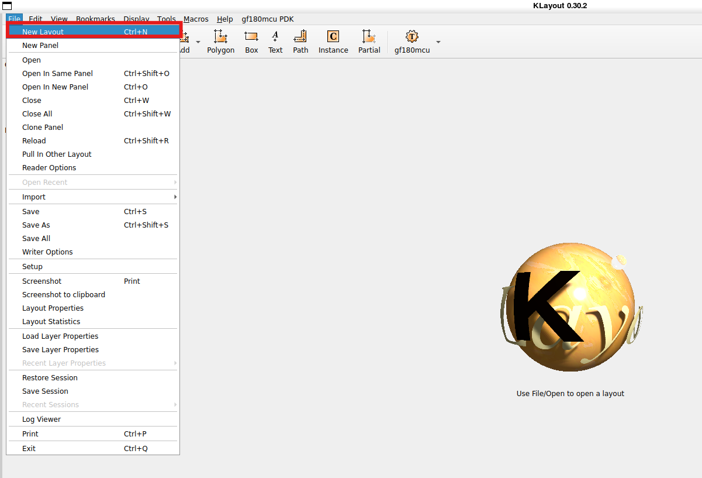
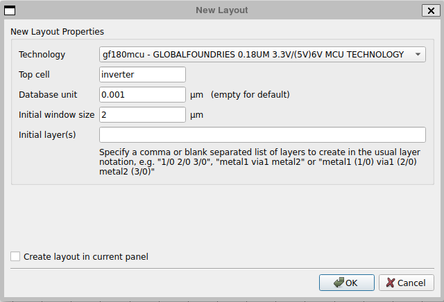
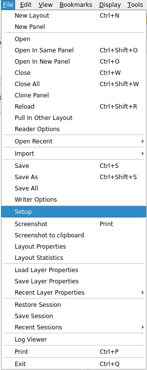
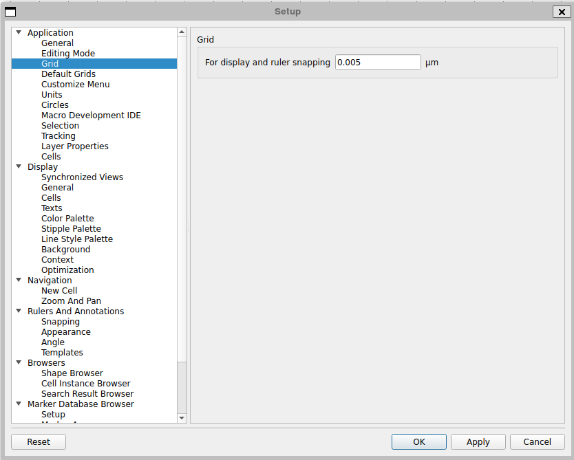
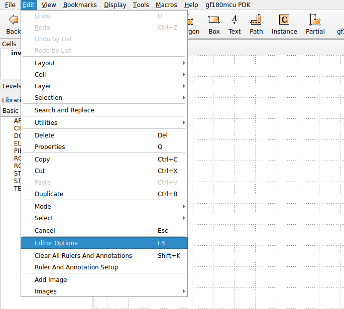
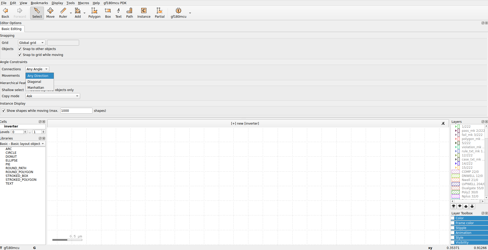
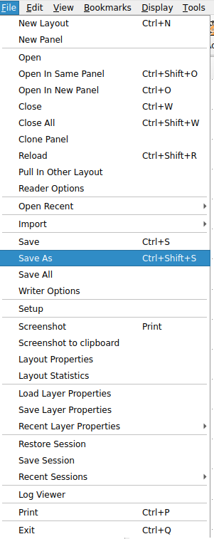
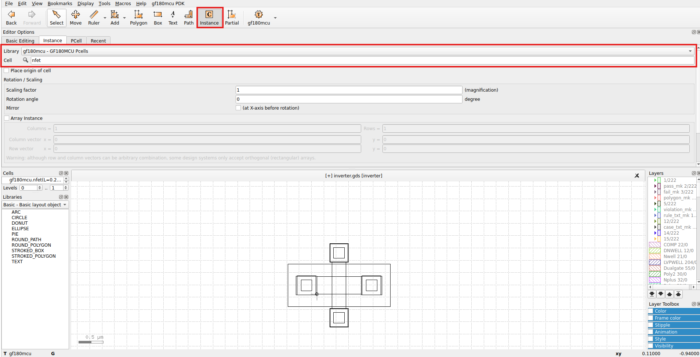
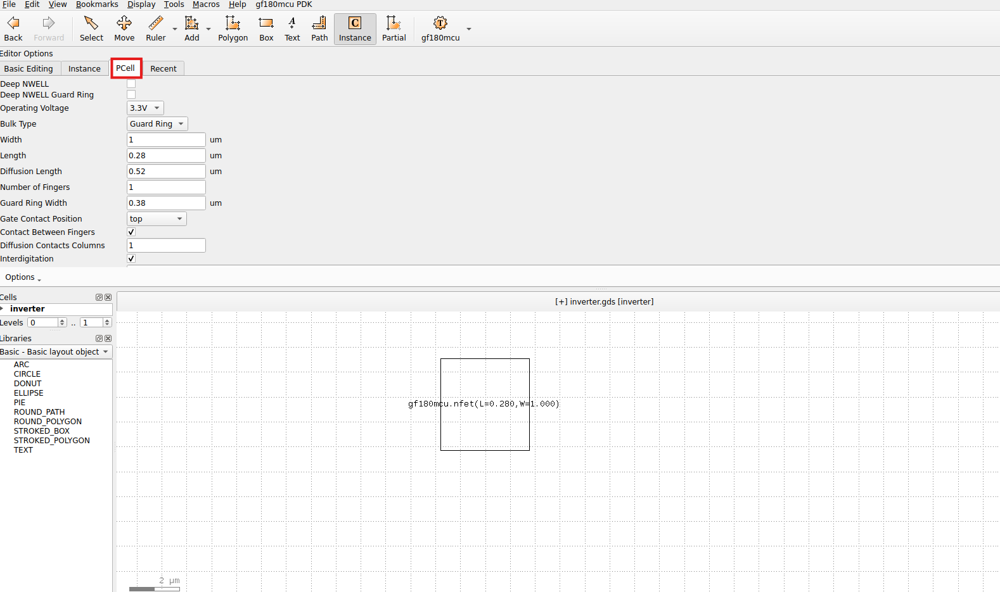
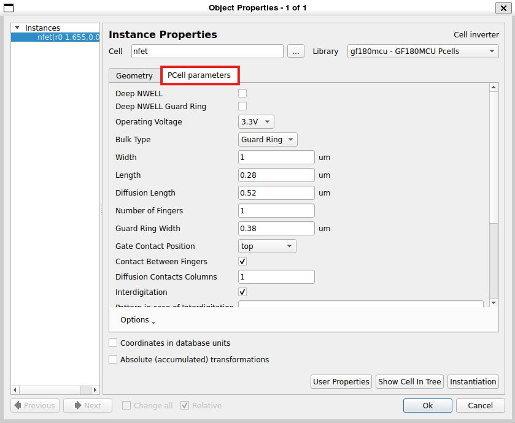

### Starting with Klayout 

To open Klayout in editor mode, use the following command:
```
klayout -e
```
Click on **File** and then in **New Layout** to create a new layout, as indicated below.

<p align="center">
   
</p> 

In the *New Layout Properties* menu, set *Top cell* with the same name as the cell designed in Xschem and set *Database unit* to 0.001 um, as show below.

<p align="center">
   
</p> 

Go to *Editor options* to set the grid, as illustrated below.

<p align="center">
   
</p> 

Then define the grid to 0.005 um, as indicated below.

<p align="center">
   
</p> 

Now, click on the **Edit** button and click on the *Editor Options* to set *Movements* option to move the cells in *Any Direction*, *Diagonal*, and *Manhattan* (which corresponds to X-Y 90° movement), as illustrated below.

<p align="center">
   
</p> 

<p align="center">
   
</p> 

<p align="center">
   
</p> 

To save the file, go to **File** and then click on *Save as*. Then, name the gds file with the same name as the Xschem file.

<p align="center">
   
</p> 

<p align="center">
   
</p> 

To place the Pcells associated with the PDK cells in the layout area, click on  **Instance**, then in the *Library* option, and select *gf180mcu - GF180MCU Pcells*. This, will allow to select the different pcells associated with the PDK.

<p align="center">
   
</p> 

To change the properties of the cell to be instantiated, select the **PCell** option and set the same parameters as the ones in the schematic. This could be also done after instantiating the cell in the layout area, by click in the cell, pressing **Q**, and then selecting the *Pcell Parameters* option. The two options mentioned are shown below.

<p align="center">
   
</p> 

<p align="center">
   
</p> 
