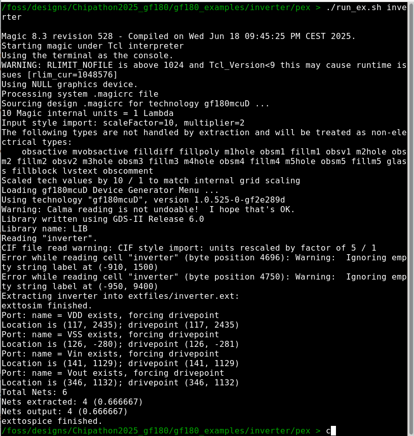
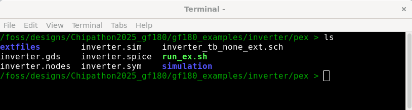

Once LVS and DRC flows are clean. Then, parasitic extraction flow is required to test the design after layout implementation. To keep everything organized, 
a pex folder was created to include all the files associated with parasitic extraction (pex) flow. First of all, the layout file (inverter.gds) would be copied to this
folder. Then the following command needs to be run on the terminal to run parasitic extraction flow:

```
.\run_ex.sh inverter
```
Check the **run_ex.sh** file to identify all the commands used to do extraction. Remember to make executable this file (this should be done all one time).
The command used for making it executable is:

```
chmod +x run_ex.sh
```

Finally, the parameter **inverter** corresponds to the cell name saved on the **inverter.gds** file. In this case the name is the same as for the schematic
file to avoid any issue during LVS flow.

<p align="center">
   
</p> 

Several files were created during this step, please take a look to all of them, as indicated in the figure below.

<p align="center">
   
</p> 
