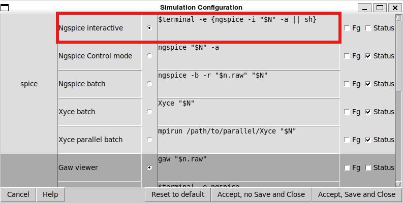
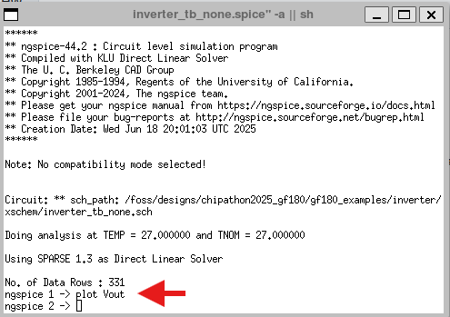
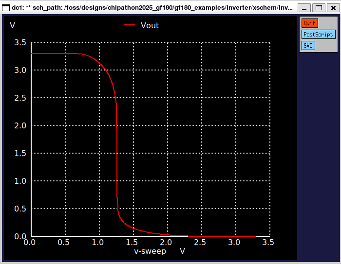

### Inverter setups
Below, are some of the different configurations and setups for waveform visualization in Xschem.

## inverter_tb_tran_none.sch
This testbench runs a DC simulation for the inverter.The configuration used is the **Ngspice interactive** mode, as indicated in the image below.

   

  

Once, set the correct configuration, ngspice terminal opens, allowing the possibility to plot the output with the following instruction: **plot Vout**.

   

  

Finally, the image below presents the DC simulation results for Vout vs Vin.

   

 

## inverter_tb_tran_xschem.sch
**References:**
1) https://www.youtube.com/watch?v=qbf9CbWoX4w

## inverter_tb_tran_gaw.sch
**References:**
1) https://www.youtube.com/watch?v=tfPqrM7VaEs
2) https://www.youtube.com/watch?v=bm3l21ExLOY&t=40s

## Hotkeys

Follows some of the most used Xschem key bindings used. More key bindings can be found in the next link:
http://repo.hu/projects/xschem/xschem_man/commands.html

|Key1  | Key2 | Description Header |
| ------------- | ------------- | ------------- |
| -  | Delete  | Delete selected objects |
| -  | Escape  | Abort, redraw, unselect |
| -  | Down  | Move down |
| -  | Up  | Move up |
| -  | Left | Move left |
| -  | Right | Move right |
| -  | 'a' | Select all |
| ctrl  | 'e' | Back to parent schematic |
| -  | 'e' | Descend to schematic |
| -  | 'f' | Full zoom |
| shift | 'I' | Insert symbol |
| -  | 'm' | Move selected objects |
| ctrl  | 'm' | Move selected objects, stretching wires attached to them |
| alt  | 'r' | Rotate objects around their anchor points |
| shift  | 'R' | Rotate |
| ctrl  | 's' | Save schematic |
| shift  | 'U' | Redo |
| -  | 'u' | Undo |
| -  | 'w' | Place wire |
| -  | 'z' | Zoom box |
| shift  | 'Z' | Zoom in |
| ctrl | 'z' | Zoom out |

