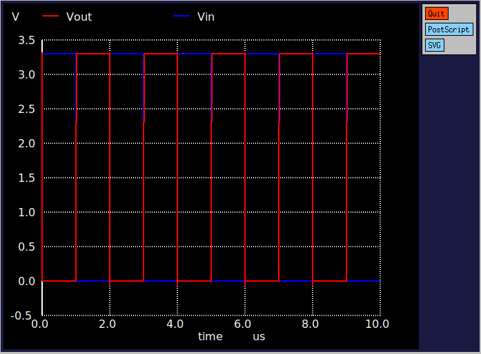
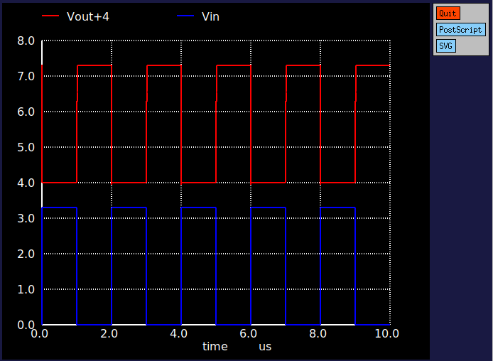
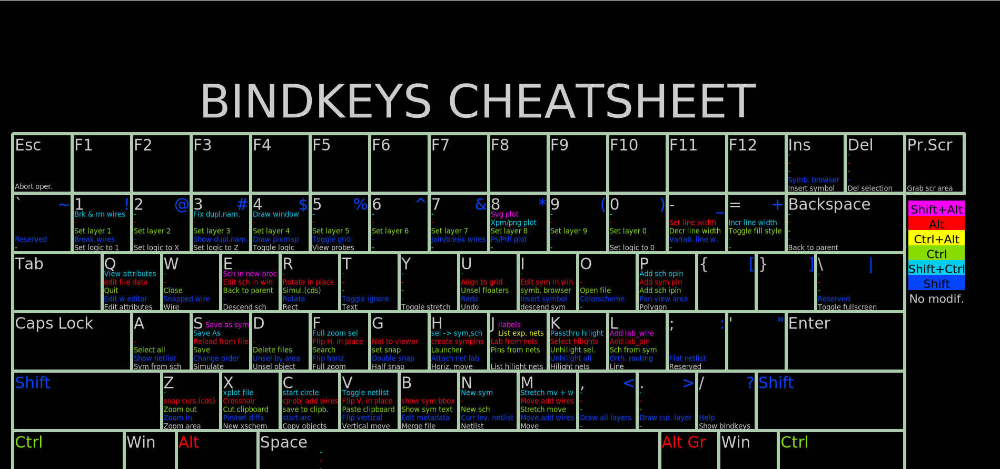

### Inverter setups
The different configurations and setups for waveform visualisation in Xschem are shown below.

## inverter_tb_tran_none.sch
This testbench runs a DC simulation for the inverter. The **Ngspice interactive** mode is used for the configuration, as shown in the image below.

   

  

Once the correct configuration has been set, the ngspice terminal opens, allowing you to plot the output using the following instruction: **plot Vout**.

   

  

Finally, the image below shows the results of the DC simulation for Vout versus Vin.

   

 

## inverter_tb_tran_xschem.sch
This testbench runs a transient simulation for the same inverter, using the same configuration as below in **Ngspice interactive** mode.
To plot Vout and Vin together using the Ngspice terminal, enter the following command: **plot Vout Vin**.

   

 
 
One useful trick for achieving a better visualisation of the waveforms is to include an offset in one of the plotted waveforms. The following command illustrates this: **plot Vout+4 Vin**.

   

 

**References:**
1) https://www.youtube.com/watch?v=qbf9CbWoX4w

## inverter_tb_tran_gaw.sch
**References:**
1) https://www.youtube.com/watch?v=tfPqrM7VaEs
2) https://www.youtube.com/watch?v=bm3l21ExLOY&t=40s

## Hotkeys
In the Xschem GUI, select the **Help** option to access the *Keys* and *Show Keybindings* options. These allow you to view a list of the available key bindings and their descriptions, as well as a handy keybinding cheat sheet (see the image below).

   

 

Below are some of the most commonly used XSchem key bindings. More key bindings can be found via the following link or in the *Keys* menu option:
http://repo.hu/projects/xschem/xschem_man/commands.html

|Key1  | Key2 | Description Header |
| ------------- | ------------- | ------------- |
| -  | Delete  | Delete selected objects |
| -  | Escape  | Abort, redraw, unselect |
| -  | Down  | Move down |
| -  | Up  | Move up |
| -  | Left | Move left |
| -  | Right | Move right |
| -  | 'a' | Select all |
| ctrl  | 'e' | Back to parent schematic |
| -  | 'e' | Descend to schematic |
| -  | 'f' | Full zoom |
| shift | 'I' | Insert symbol |
| -  | 'm' | Move selected objects |
| ctrl  | 'm' | Move selected objects, stretching wires attached to them |
| alt  | 'r' | Rotate objects around their anchor points |
| shift  | 'R' | Rotate |
| ctrl  | 's' | Save schematic |
| shift  | 'U' | Redo |
| -  | 'u' | Undo |
| -  | 'w' | Place wire |
| -  | 'z' | Zoom box |
| shift  | 'Z' | Zoom in |
| ctrl | 'z' | Zoom out |

